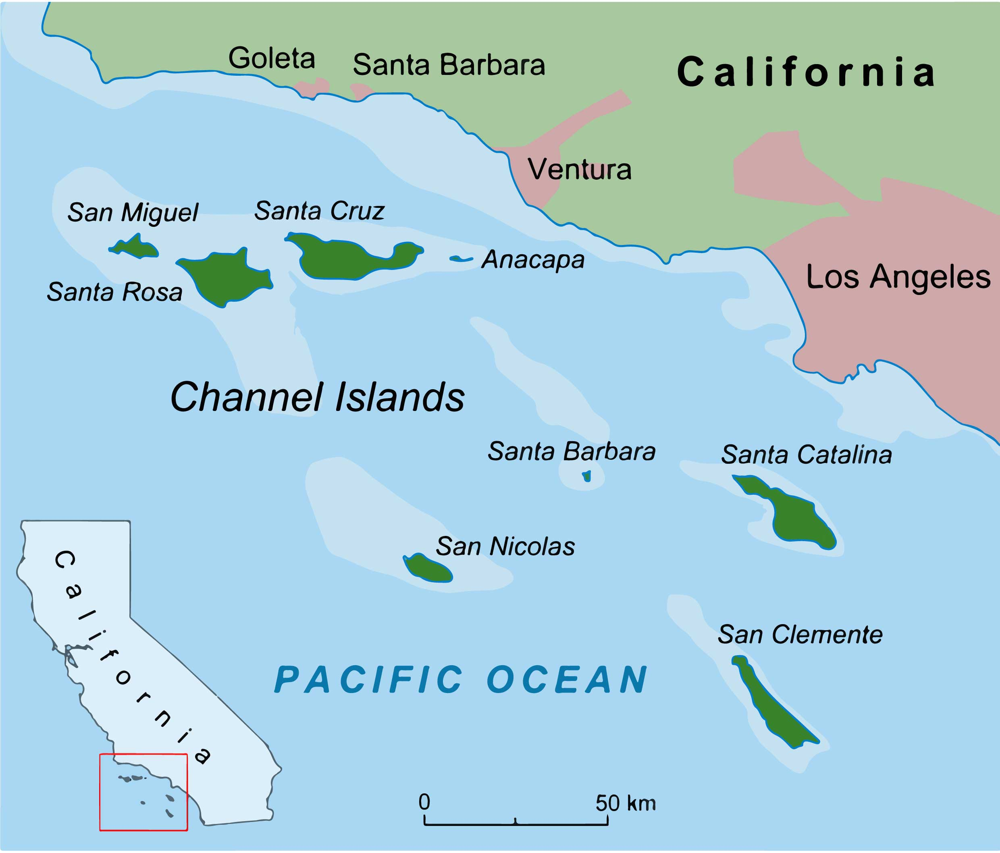

# Deer mice in the Channel Island Archipelago

{: style="float: left; margin-right: 20px;" width="500px"} 
Deer mice (_Peromyscus maniculatus_) are the most abundant mammals in North America and are among the few that have colonized the Channel Island Archipelago. They are the only native terrestrial mammal present on all eight Channel Islands and are recognized as a different subspecies on each. The island fox (_Urocyon littoralis_) is the only resident mammalian top predator and is absent from the two smallest islands, Anacapa and Santa Barbara Island. Consequently, mice on these two islands have not encountered foxes in evolutionary time. Trapping experiments showed that – in contrast to their conspecifics – mice on the two historically fox-free islands do not discriminate against traps containing fox feces, a source of repellent that usually elicits aversive behaviors. The molecular and genetic bases underlying variation in this behavior, whether the aversive response was lost independently in the two fox-free island populations, and whether it is correlated to other behaviors is currently unknown. 



## Santa Cruz Island



{% include figure.html
  image="images/CIs/pilotassay.jpg"
  width="350px"
  caption="McGuyvering a makeshift behavioral arena (~60% of fieldwork)   ...and showing off the latest German backpacker fashion."
%}



## Anacapa Island





## Santa Catalina Island





## Some of the local fauna


