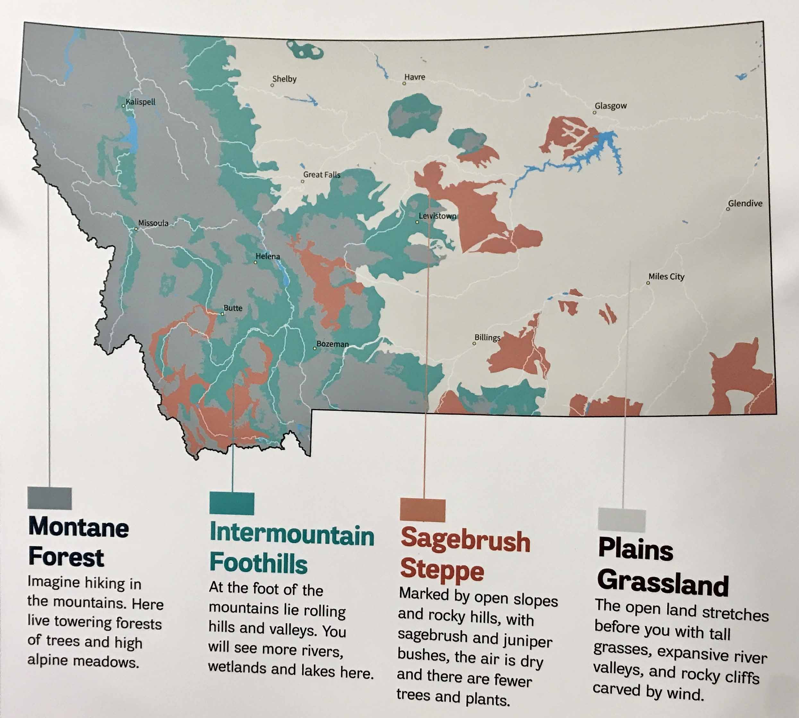

# Forest and prairie ecotypes of deer mice in Northwest Montana

{: style="float: right; margin-left: 20px;" width="500px"} 
I was recently part of a field trip to Montana that was spearheaded by fellow Hoekstra lab postdoc Dr. Kelsey Tyssowski. Despite the frosty MT November temperatures we had an absolute blast and successfully trapped mice in a prairie and in a forest habitat. Below are some fieldwork impressions. 



## Prairie site





## Forest site





## Some of the local fauna


